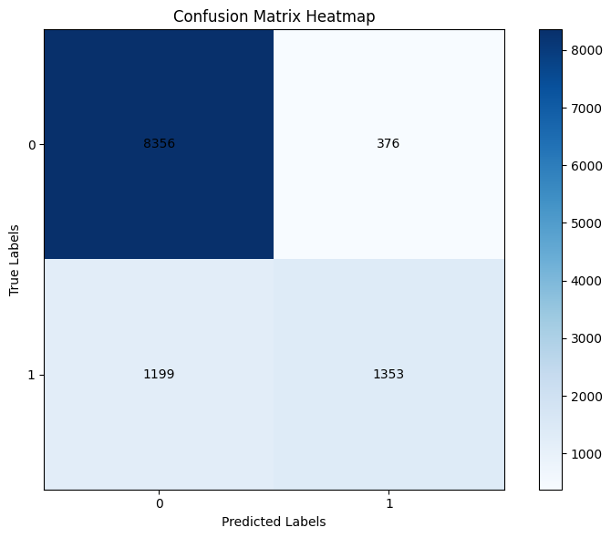
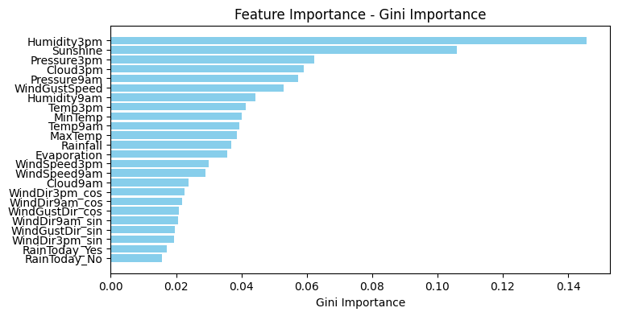
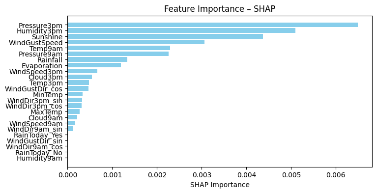
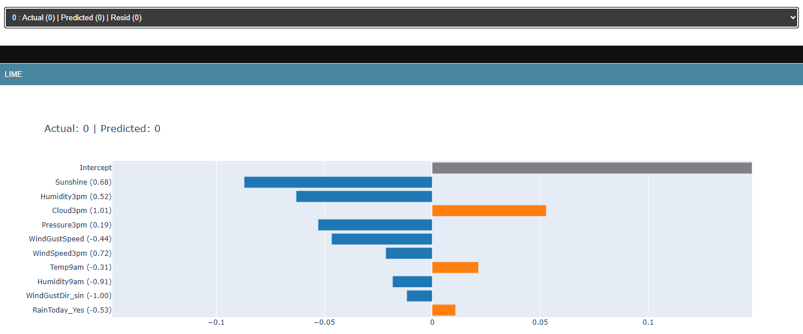
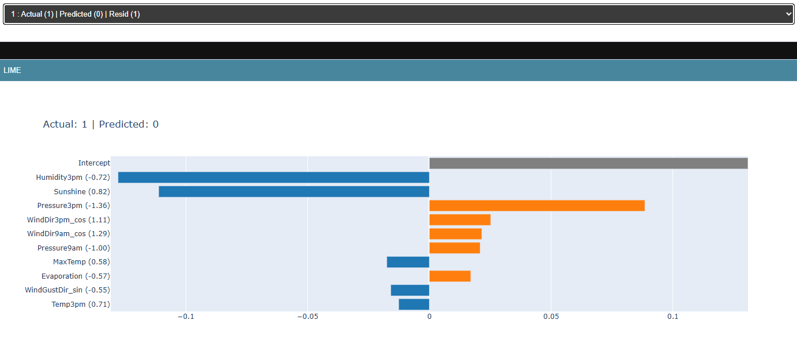

# Rainfall Prediction with Explainable AI

## Project Description
This project builds a machine learning classifier to predict next‑day rainfall using the *Rain in Australia* dataset. The focus is on understanding how a non‑interpretable (black‑box) model makes decisions through Explainable AI techniques. The workflow includes data preprocessing, model training, evaluation, and a full suite of XAI analyses such as Feature Importance, PDP, ICE, SHAP, LIME, and comparisons with glass‑box models. The goal is to combine predictive performance with transparent, well‑structured interpretability.

---

## Requirements
Install all dependencies with:

```bash
pip install -r requirements.txt
```

## Dataset

The dataset is **not included** in this repository.

You can download the *Rain in Australia* dataset from Kaggle (accessed in March 2026):

https://www.kaggle.com/datasets/jsphyg/weather-dataset-rattle-package

After downloading, place the file **`weatherAUS.csv`** inside the `data/` directory.

## Project Results

### Random Forest classifier results



### Feature Importance

From model:


SHAP-value-based importance calculated from 5 samples:


Humidity3pm, Pressure3pm and Sunshine seem to be the three most important features.

### LIME

True negative:


False negative:

The Pressure3pm feature of high importance tried to 'persuade' the model towards positive, but lost the fight against equally important features Humidity3pm and Sunshine.
